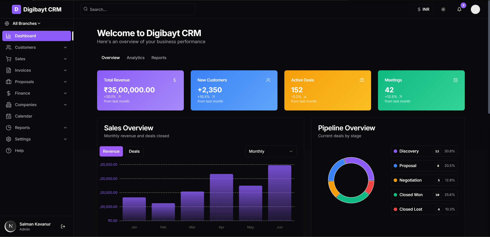

# 🌐 Multi-Branch CRM System

A comprehensive Customer Relationship Management (CRM) system built with Next.js, designed to support multiple branches, currencies, and tax systems.



## 📑 Table of Contents

- [🌟 Features](#-features)
- [🔧 Technology Stack](#-technology-stack)
- [🚀 Getting Started](#-getting-started)
  - [📋 Prerequisites](#-prerequisites)
  - [⚙️ Installation](#️-installation)
  - [💻 Development](#-development)
- [📂 Project Structure](#-project-structure)
- [🔑 Configuration](#-configuration)
  - [🔐 Environment Variables](#-environment-variables)
  - [💾 Database Setup](#-database-setup)
  - [🔒 Authentication](#-authentication)
- [📊 Core Modules](#-core-modules)
  - [👥 Customer Management](#-customer-management)
  - [📝 Invoice System](#-invoice-system)
  - [💰 Financial Management](#-financial-management)
  - [🏢 Multi-Branch System](#-multi-branch-system)
  - [💼 Tax Management](#-tax-management)
- [🚢 Deployment](#-deployment)
  - [☁️ Vercel Deployment](#️-vercel-deployment)
  - [🐳 Docker Deployment](#-docker-deployment)
  - [🖥️ Traditional Hosting](#️-traditional-hosting)
- [⚡ Performance Optimization](#-performance-optimization)
- [🔐 Security Considerations](#-security-considerations)
- [🧪 Testing](#-testing)
- [🤝 Contributing](#-contributing)
- [📜 License](#-license)
- [🆘 Support](#-support)

## 🌟 Features

### 💼 Core Functionality
- **👥 Customer Management**: Track and manage customer information, interactions, and history
- **📝 Invoice Management**: Create, edit, and track invoices with automatic tax calculations
- **📈 Opportunity Pipeline**: Monitor sales opportunities through various stages
- **📋 Proposal Tracking**: Create and track business proposals
- **🏭 Company Management**: Organize and manage company information

### 💰 Financial Tools
- **📊 Financial Dashboard**: Overview of financial health with interactive charts
- **💹 Income & Expense Tracking**: Monitor financial flows with detailed categorization
- **📜 Transaction History**: Complete record of all financial transactions
- **🏦 Account Management**: Track multiple financial accounts in one place

### 🏢 Multi-Branch Support
- **🏬 Branch Management**: Create and manage multiple business branches
- **📈 Branch-specific Reporting**: View performance metrics by branch
- **⚖️ Branch Comparison**: Compare performance across different branches

### 💱 Multi-Currency Support
- **🔄 Currency Settings**: Configure and manage multiple currencies
- **💱 Automatic Currency Conversion**: Real-time conversion between currencies
- **🔣 Currency-specific Formatting**: Proper formatting for different currency systems (including Indian number formatting)

### 📊 Tax Management
- **⚙️ Tax Configuration**: Set up different tax systems (GST, VAT, etc.)
- **🧮 Automatic Tax Calculation**: Taxes automatically calculated based on location and rules
- **📑 Tax Reporting**: Generate tax reports for compliance purposes

### 📊 Visualization & Analytics
- **📈 Interactive Dashboards**: Visual representation of key metrics
- **📊 Sales Charts**: Track sales performance over time
- **🔄 Pipeline Analytics**: Visual representation of your sales pipeline
- **💹 Financial Charts**: Visualize financial data with interactive charts

## 🔧 Technology Stack

- **🖥️ Frontend Framework**: Next.js 14 with App Router
- **📝 Programming Language**: TypeScript
- **⚛️ UI Library**: React 18
- **🎨 Styling**: 
  - Tailwind CSS for utility-first styling
  - shadcn/ui components for consistent UI elements
- **🧠 State Management**: 
  - React Context API for global state
  - React Hooks for component-level state
- **📊 Data Visualization**: Recharts for interactive charts and graphs
- **📋 Form Handling**: React Hook Form with Zod validation
- **💾 Database**: MongoDB (with Mongoose ODM)
- **🔐 Authentication**: NextAuth.js
- **🔌 API**: Next.js API Routes and Server Actions
- **🚀 Deployment**: Vercel (optimized for Next.js)

## 🚀 Getting Started

### 📋 Prerequisites
- Node.js 18.0 or later
- npm 8.0+ or yarn 1.22+
- MongoDB instance (local or cloud-based like MongoDB Atlas)
- Git for version control

### ⚙️ Installation

1. Clone the repository:
   ```bash
   git clone https://github.com/yourusername/multi-branch-crm.git
   cd multi-branch-crm
   ```

2. Install dependencies:
   ```bash
   npm install
   # or
   yarn install
   ```

3. Set up environment variables:
   - Copy `.env.example` to `.env.local`
   - Update the values according to your setup

4. Start the development server:
   ```bash
   npm run dev
   # or
   yarn dev
   ```

## 📂 Project Structure

```
/
├── app/                    # Next.js App Router pages
│   ├── api/                # API routes
│   ├── customers/          # Customer management pages
│   │   ├── [id]/           # Customer detail page
│   │   ├── new/            # New customer page
│   │   └── page.tsx        # Customers list page
│   ├── companies/          # Company management
│   ├── invoices/           # Invoice management
│   │   ├── [id]/           # Invoice detail page
│   │   ├── new/            # New invoice page
│   │   └── page.tsx        # Invoices list page
│   ├── opportunities/      # Opportunity management
│   ├── proposals/          # Proposal management
│   ├── finance/            # Financial management
│   │   ├── income/         # Income tracking
│   │   ├── expenses/       # Expense tracking
│   │   ├── transactions/   # Transaction history
│   │   ├── accounts/       # Account management
│   │   └── page.tsx        # Financial dashboard
│   ├── settings/           # Application settings
│   │   ├── branches/       # Branch management
│   │   ├── currencies/     # Currency settings
│   │   ├── taxes/          # Tax configuration
│   │   └── page.tsx        # Settings dashboard
│   ├── layout.tsx          # Root layout with providers
│   └── page.tsx            # Main dashboard
├── components/             # React components
│   ├── dashboard/          # Dashboard components
│   ├── finance/            # Financial components
│   ├── invoices/           # Invoice components
│   ├── ui/                 # UI components (shadcn)
│   ├── header.tsx          # Application header
│   ├── sidebar.tsx         # Navigation sidebar
│   └── toaster.tsx         # Toast notifications
├── contexts/               # React contexts
├── lib/                    # Library code
├── models/                 # Database models
├── utils/                  # Utility functions
├── public/                 # Static assets
├── styles/                 # Global styles
├── types/                  # TypeScript type definitions
└── configuration files     # Various config files
```

## 🔑 Configuration

### 🔐 Environment Variables

Create a `.env.local` file in the root directory with the following variables:

```
# Application
NEXT_PUBLIC_APP_URL=http://localhost:3000

# Database
MONGODB_URI=your_mongodb_connection_string
MONGODB_DB=your_database_name

# Authentication
NEXTAUTH_SECRET=your_nextauth_secret
NEXTAUTH_URL=http://localhost:3000

# Admin User (for initial setup)
ADMIN_EMAIL=admin@example.com
ADMIN_PASSWORD=your_secure_password
ADMIN_NAME=Admin User

# Optional: External Services
# SMTP_HOST=your_smtp_host
# SMTP_PORT=your_smtp_port
# SMTP_USER=your_smtp_username
# SMTP_PASSWORD=your_smtp_password
# SMTP_FROM=noreply@example.com
```

### 💾 Database Setup

This CRM uses MongoDB as its database. You can:
- Use a local MongoDB instance
- Use MongoDB Atlas (cloud-based)
- Use any MongoDB-compatible database service

### 🔒 Authentication

This CRM uses NextAuth.js for authentication. The default setup includes:

- Email/Password authentication
- Role-based access control (Admin, Manager, Staff)
- Session management
- Protected routes

To customize authentication:

1. Edit `lib/auth.ts` to modify providers or callbacks
2. Update middleware.ts for route protection rules

## 📊 Core Modules

### 👥 Customer Management

The customer management module allows you to:

- Create and manage customer profiles
- Track customer interactions
- View customer purchase history
- Segment customers by various attributes
- Assign customers to specific branches

Key files:
- `app/customers/page.tsx`: Customer listing
- `app/customers/[id]/page.tsx`: Customer details
- `app/customers/new/page.tsx`: New customer form

### 📝 Invoice System

The invoice system provides:

- Creation of professional invoices
- Automatic tax calculation based on location and rules
- Multiple currency support
- PDF generation and email sending
- Payment tracking

Key files:
- `app/invoices/page.tsx`: Invoice listing
- `app/invoices/[id]/page.tsx`: Invoice details
- `app/invoices/new/page.tsx`: New invoice form
- `utils/tax-utils.ts`: Tax calculation utilities

### 💰 Financial Management

The financial module includes:

- Income and expense tracking
- Transaction history
- Account management
- Financial reporting
- Cash flow analysis

Key files:
- `app/finance/page.tsx`: Financial dashboard
- `app/finance/income/page.tsx`: Income tracking
- `app/finance/expenses/page.tsx`: Expense tracking
- `components/finance/finance-chart.tsx`: Financial visualizations

### 🏢 Multi-Branch System

The multi-branch system allows:

- Management of multiple business locations
- Branch-specific reporting
- Performance comparison between branches
- Branch-specific settings

Key files:
- `app/settings/branches/page.tsx`: Branch management
- `components/dashboard/branch-performance.tsx`: Branch performance charts

### 💼 Tax Management

The tax system supports:

- Multiple tax systems (GST, VAT, etc.)
- Region-specific tax rules
- Automatic tax calculation
- Tax reporting for compliance

Key files:
- `app/settings/taxes/page.tsx`: Tax configuration
- `utils/tax-utils.ts`: Tax calculation utilities
- `components/invoices/tax-info-card.tsx`: Tax information display

## 🚢 Deployment

### ☁️ Vercel Deployment

For the simplest deployment experience:

1. Push your repository to GitHub
2. Import the project to Vercel
3. Configure environment variables
4. Deploy!

### 🐳 Docker Deployment

For containerized deployment:

1. Build the Docker image:
   ```bash
   docker build -t multi-branch-crm .
   ```

2. Run the container:
   ```bash
   docker run -p 3000:3000 -e MONGODB_URI=your_uri multi-branch-crm
   ```

### 🖥️ Traditional Hosting

For traditional hosting:

1. Build the application:
   ```bash
   npm run build
   # or
   yarn build
   ```

2. Start the production server:
   ```bash
   npm start
   # or
   yarn start
   ```

## ⚡ Performance Optimization

- Uses Next.js App Router for efficient routing and rendering
- Implements React Server Components for optimal performance
- Utilizes MongoDB indexes for faster queries
- Employs image optimization via Next.js Image component
- Implements proper data fetching strategies

## 🔐 Security Considerations

- All routes are protected with NextAuth.js authentication
- Role-based access control for different user levels
- Data validation using Zod schemas
- CSRF protection
- HTTP-only cookies for session management
- Environmental variable protection

## 🧪 Testing

To run tests:

```bash
npm run test
# or
yarn test
```

## 🤝 Contributing

Contributions are welcome! Please feel free to submit a Pull Request.

1. Fork the repository
2. Create your feature branch (`git checkout -b feature/amazing-feature`)
3. Commit your changes (`git commit -m 'Add some amazing feature'`)
4. Push to the branch (`git push origin feature/amazing-feature`)
5. Open a Pull Request

## 📜 License

This project is licensed under the MIT License - see the LICENSE file for details.

## 🆘 Support

For support, please reach out to:
- Create an issue in the GitHub repository
- Contact the development team at hello@salmanmp.me